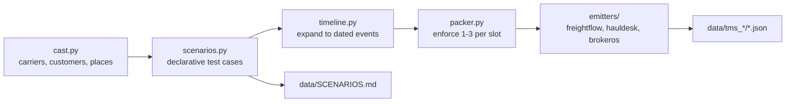

# Synthetic Sync Data Generator

Scope is the data layer only. This produces the fixture corpus and the document that explains it; the ranking algorithm and platform remain out of scope.

## Why the design looks like this

The spec caps each sync file at 1-3 loads, and there are 40 files per broker over 10 days. That is a hard ceiling of 120 load-appearances per broker, and a full lifecycle burns 5-6 of them. Every sizing decision below follows from that budget.

Target per broker: ~100 appearances producing ~35 distinct loads, ~30 of which get covered by a carrier.

- 10 carriers per broker: 2 veterans (~8 loads each), 3 middling (~3), 5 thin (0-1)
- Lane depth: one rich lane (~10 loads), two medium (~6 and ~5), two thin (2 each), remainder intra-metro and miscellaneous

The consequence worth designing around: carrier-by-lane sample sizes land at n = 1 to 3. The corpus is built to make shrinkage, explicit confidence, and geographic fallback necessary rather than optional.

## Calendar

Day 1 is `2026-07-06`, matching the provided examples. Day 10 is `2026-07-15`, day 11 is `2026-07-16`.

- Days 1-10: 4 syncs/day x 10 days x 3 TMS = 120 files
- Day 11: 3 syncs x 3 TMS = 9 files, carrying 6-8 unbooked loads spread across all three brokers so each has something to answer for
- Filenames follow `{YYYY-MM-DD}T{HH-MM}_sync.json`, overwriting the empty placeholders already present

## Architecture

New directory `tools/datagen/`, kept out of `backend/` so it reads as a development tool rather than shipped code. Seeded RNG throughout; running it twice byte-for-byte reproduces the corpus.

The core move is a **canonical load model** that scenarios author against, with three emitters rendering it into each TMS's shape. Scenario authoring stays TMS-agnostic, and the emitters become the single place where each system's quirks live.

## Critical constraint on the place table

The internal place table carries lat/lon so the generator can reason about metro membership and deadhead distance. **Emitted files must carry only city, state, and zip.** Leaking coordinates into the fixtures would hand the platform the lane-clustering answer for free and defeat the central problem in the README. Deriving geography from zip is the platform's job.

Place coverage spans suburbs, not city centers: DFW (Grand Prairie, Arlington, Irving, Plano, Fort Worth, Denton, Waxahachie), Houston (Katy, Pasadena, Sugar Land, Baytown, Pearland, Conroe), San Antonio (New Braunfels, Schertz, Seguin, Selma, San Marcos).

## The planted test cases

Each is a day-11 load plus the history that gives it a predetermined right answer.

- **Sanity** — rich lane, one unambiguous winner
- **Near-miss lane** — history is Grand Prairie to Katy; the day-11 load is Arlington to Sugar Land. Exact-city matching finds nothing, metro clustering finds a strong candidate
- **Small-sample trap** — carrier with 1 excellent load on the lane against a carrier with 12 slightly worse. Naive mean and shrinkage disagree
- **Deadhead isolation** — two carriers with deliberately identical lane history, one last delivered 20 miles from the pickup, the other 250. Any ranking gap is attributable to deadhead alone
- **Equipment constraint** — reefer load, strong lane carrier who has only run flatbed
- **Cold lane** — zero history, forcing the pricing fallback to reveal itself
- **Correction that moves the answer** — a day-9 rate restatement feeding a day-11 estimate, so the answer can be demoed before and after ingesting one file
- **Directionality** — carrier heavy on Houston to DFW, empty on the reverse
- **Cross-broker twin** — same MC/DOT in two brokers with divergent performance and slightly different name strings (`DELTA PRIME LLC` vs `Delta Prime, LLC`). Regression test against keying carrier statistics on a global MC/DOT record

Also planted for the geography argument: intra-metro loads such as Fort Worth to Plano, so "Texas to Texas" spans 20 to 275 miles and is self-evidently useless as a lane definition.

## Quirks assigned per emitter

Rather than spreading messiness evenly, each TMS owns a distinct failure mode:

- **FreightFlow** — whole-object restatement, loads with 3+ stops, uppercase cities, free-text equipment strings needing parsing
- **HaulDesk** — append-only rate rows including a negative `ADJUSTMENT`, kg/km conversion, numeric status codes, a carrier row that changes in a later sync
- **BrokerOS** — silent `bos__Carrier_Rate__c` restatement with no marker, a null equipment value, weight in line items with one record in `kg` to catch a hardcoded lbs assumption, UTC timestamps against HaulDesk's naive Central

The timezone mismatch is planted deliberately with at least one load whose calendar day changes depending on handling, since day-boundary bugs quietly corrupt recency weighting.

## Sync-slot packing

Events want specific slots but the cap is 3 per file. The packer shifts overflow into the next slot, which is realistic since a change simply gets picked up by the following sync. It must also guarantee each file has at least 1 load and that a given load appears at most once per file.

## Validation

A `validate.py` that fails loudly on: file counts, the 1-3 bound, chronological monotonicity, referential integrity (BrokerOS `referenced_records` resolves, HaulDesk `carrier_ref` resolves), status monotonicity except the one deliberate reversion, unit range sanity for kg vs lbs, and presence of every declared scenario.

## Manifest

`data/SCENARIOS.md` is generated from the scenario definitions rather than hand-written, so it cannot drift. Each entry lists the scenario, the exact files carrying it, and the behavior the system should produce. This is both the fixture index and the walkthrough script for the review call, and it directly serves the requirement that a reader can trace why each day-11 answer came out as it did.