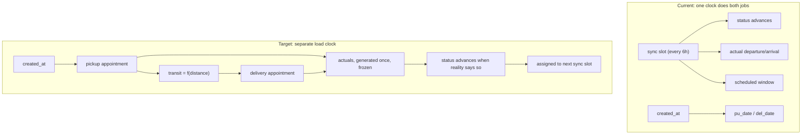

# Data Coherence Repair

Prerequisite work before the carrier-ranking algorithm. The ranker will be designed against this corpus, so the corpus has to be trustworthy first.

**Hard constraint: no shape changes.** Every fix below uses fields already documented in `data/tms_a_freightflow/example_sync.jsonc`, `data/tms_b_hauldesk/example_sync.jsonc`, and `data/tms_c_brokeros/example_sync.jsonc`. Nothing is added, removed, or renamed.

## Root cause

The generator has no physical clock. Timestamps are derived from the sync slot with fixed offsets, while the freight calendar is derived separately from `created_at`, and the two were never reconciled.

## Coherence bugs to fix

All four live in [tools/datagen/emitters/__init__.py](tools/datagen/emitters/__init__.py) and [tools/datagen/timeline.py](tools/datagen/timeline.py).

- **Appointment drifts with the sync clock.** `estimatedReadyDateTime` is computed from `slot_datetime(event.slot)`, so a load's pickup window silently moves when it is touched in a later day's slot. Note that line 120 already computes the correct load-stable anchor from `created_at` and never uses it.
- **Recorded actuals get rewritten.** `actualDepartureDateTime` is recomputed as `slot - 2h` on every event, so one shipment reports departing at 10:00, then 16:00, then 22:00. Actuals must be generated once and echoed unchanged.
- **Transit is always one hour**, regardless of a 45-mile or 275-mile lane, because pickup uses `slot - 2h` and delivery uses `slot - 1h`.
- **Loads complete before they pick up.** `COMPRESSED_OFFSETS` advances ACTIVE to COMPLETED in 3 slots (18 hours) while freight is scheduled a day or two out.

## Schema fidelity fixes

- Remove `bos__MC_Number__c`, `bos__DOT_Number__c`, and `Phone` from BrokerOS carrier Accounts. Only `type`, `record_type`, `Name` are documented. Consequence to record in [DECISIONS.md](DECISIONS.md): broker C has no federal authority identifier, so MC/DOT cross-system matching covers FreightFlow and HaulDesk only.
- Emit HaulDesk `carriers` rows only on first appearance or on change, per "first seen or last changed". Currently repeated in every referencing sync.
- Move the multi-stop case from FreightFlow to BrokerOS, which documents more than two stops and uses `bos__Is_Pickup__c` / `bos__Is_Dropoff__c` booleans. This removes the invented `"Stop 2"` value and keeps FreightFlow to the two documented `stopType` values.
- Coerce money and weight to float so `totalSell` serializes as `1490.0`, matching the examples.

## Signal quality, within the existing schemas

- **Per-carrier reliability profiles** so on-time performance varies (a veteran near 95 percent, a few weak performers well below). Coherent timestamps alone produce no ranking signal if every carrier is punctual.
- **Vary weight, commodity, and pallet count**, currently pinned at 24000.0 lbs, "General freight", and 18.0.
- **Exercise the full documented status vocabulary.** Add a `PLANNED` canonical state, which the README lists first and the model omits, mapping to `Quoting` / `10` / `Quotes Requested`. Also cover `At Shipper`, `At Receiver`, `40 Rolling`, `50 Unloaded`, and `Invoiced`.
- **Add one or two carrier reassignments** so fall-through is detectable. This uses existing fields and is sanctioned by "the later file is the newer truth for that load".

## Verification

Extend [tools/datagen/validate.py](tools/datagen/validate.py) with assertions that would have caught all four bugs:

- Actual departure falls within the scheduled window, within tolerance
- Arrival strictly follows departure, and transit is consistent with distance at a plausible average speed
- A load's scheduled window is stable across syncs unless a correction is declared
- An actual timestamp, once present, never changes in a later sync
- No status regression except the one deliberate reversion

Then regenerate, confirm the planted scenarios still hold (the Comal Creek versus Brazos small-sample trap, the FreightFlow/HaulDesk twin, BrokerOS directionality, deadhead isolation), and refresh `data/SCENARIOS.md`.

Expect realistic lifecycles to leave some late-created loads mid-flight at day 11. That is correct behavior and does not cost price history, since a carrier rate exists from COVERED onward.