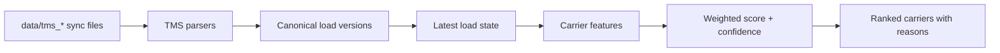

# Carrier Ranking Algorithm

Scope: backend ranking engine and tests. UI/API wiring can come afterward. The algorithm should be deterministic, explainable, tenant-isolated, and honest about confidence.

## Core Principles

- Use only data present in the broker's streamed TMS history. No carrier call outcomes, tender rejections, GPS pings, insurance, safety, capacity boards, or external performance data.
- Treat the score as **fit for prioritizing calls**, not probability of acceptance. The TMS tells us who was booked and how they performed, not who declined.
- Keep confidence separate from score. A carrier can rank first with low confidence if the history is thin.
- Every explanation must be traceable to components that actually contributed to the score.

## Data Flow

Implementation target: new Python backend package under [backend](backend), since [backend/pyproject.toml](backend/pyproject.toml) is currently empty.

## Canonical Model

Normalize all three TMS feeds into internal records:

- `Broker`, `Carrier`, `Customer`, `Location`, `LoadVersion`, `LoadCurrent`, `RateEvent`
- Preserve raw TMS IDs and source file names for traceability
- Key tenant-scoped stats by `(broker_id, carrier_id)`, never by global MC/DOT
- Store MC/DOT only as identity metadata for FreightFlow and HaulDesk; BrokerOS has no documented authority fields per [DECISIONS.md](DECISIONS.md)

## Candidate Set

For a broker's active load:

- Include carriers known to that broker through prior booked/covered loads
- Require compatible equipment unless the target equipment is unknown
- If the lane is cold, rank all compatible broker-known carriers by broader geography, recency, reliability, and price history
- Do not include other brokers' carriers in the base algorithm; shared pool stays out of scope for this pass

## Lane Similarity

Avoid hard lane buckets. Use a distance kernel over origin and destination zip centroids:

`w_lane = exp(-origin_miles / 35) * exp(-destination_miles / 35)`

Also compute reverse-lane evidence with a discount:

`w_reverse = 0.35 * exp(-origin_to_hist_dest / 35) * exp(-dest_to_hist_origin / 35)`

Use the selected ZCTA-centroid approach: add a reference loader for real ZIP/ZCTA centroids, with tests covering every zip in the generated data.

## Score Components

All components output `0..1`. Initial weights are simple and documented, not learned:

- Lane familiarity, weight `0.28`: `1 - exp(-effective_lane_loads / 2)`
- Deadhead / positioning, weight `0.20`: recent last delivery near target pickup, falling back to historical pickup density
- Price competitiveness, weight `0.18`: shrink carrier `$/mile` toward lane/equipment/distance priors before comparing to benchmark
- Reliability, weight `0.14`: pickup/delivery appointment adherence with a Beta prior so small samples do not dominate
- Recency / relationship activity, weight `0.10`: recent completed work and total relationship depth
- Customer affinity, weight `0.05`: prior successful work for this customer, shrunk heavily
- Rate stability / fall-through, weight `0.05`: penalize corrections, large adjustments, and carrier reassignments attributable to that carrier

Score formula:

`score = sum(weight_i * component_i)`

Confidence formula is separate and based on effective lane sample size, total carrier sample size, price sample size, reliability sample size, and data completeness.

## Shrinkage

Use hierarchical shrinkage everywhere sample sizes are small:

`shrunk = (n_eff * observed + k * prior) / (n_eff + k)`

Suggested `k` values:

- Price: `k = 4`
- Reliability: Beta prior equivalent to `4` average observations
- Customer affinity: `k = 6`

Prior ladder for price:

1. Broker + equipment + similar lane kernel
2. Broker + equipment + distance band
3. Broker-wide equipment prior
4. Broker-wide all-load prior

## Explanations

Each ranking result should include:

- Final score and confidence label
- Component scores and weights
- Evidence counts: lane-effective loads, total completed loads, recent loads, reliability observations, price observations
- Human-readable reasons, e.g. "10 similar DFW-to-Houston dry-van loads", "last delivered 27 miles from pickup", "price history is 4 percent below broker lane benchmark"
- Limitations, e.g. "low confidence: no exact-lane history" or "equipment mismatch excluded flatbed history"

## Scenario Tests

Use [data/SCENARIOS.md](data/SCENARIOS.md) as the acceptance map:

- FreightFlow rich/near-miss lane ranks Ibrahim first for `ff-day11-sanity-nearmiss`
- HaulDesk small-sample trap ranks the many-load Brazos carrier above the one-load Comal outlier despite Comal's lower raw price
- Deadhead isolation gives the closer recent delivery the positioning edge
- Equipment constraint does not treat flatbed history as clean reefer evidence
- Cold lane returns low confidence with fallback reasoning
- Directionality gives reverse-lane evidence partial, not full, credit
- Cross-broker twin proves FreightFlow rankings ignore HaulDesk's good Delta Prime history

## Verification

- Unit tests for each parser against representative sync files
- Unit tests for lane kernel, reverse-lane discount, shrinkage, confidence labels, and score arithmetic
- Scenario tests for every day-11 active load
- Golden JSON snapshots for explanations so wording and component math stay stable
- Run `python3 -m tools.datagen.validate` before ranking tests so bad fixtures fail early