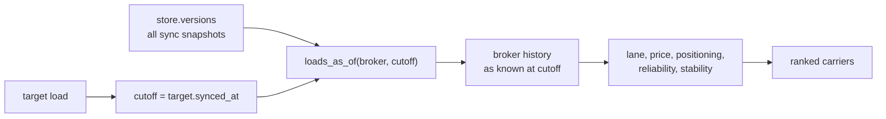

# Correctness Fixes: Data Coherence, As-Of Ranking, Reliability Semantics

Scope: bugs and correctness issues only. Platform work (API, compose, Dockerfiles, run docs) and the shared carrier pool stay out.

## Cross-reference first

Every item below was checked against [agent plans/3_carrier_ranking_algorithm_82737eb5.plan.md](agent%20plans/3_carrier_ranking_algorithm_82737eb5.plan.md), [agent plans/4_corrections_pricing_equipment_6e7e2335.plan.md](agent%20plans/4_corrections_pricing_equipment_6e7e2335.plan.md), and the three TMS schemas. Six candidate issues turned out to be deliberate and are **not** being changed:

- **`recency` blends total volume.** Plan #3 line 93 defines the component as "Recency / relationship activity: recent completed work *and* total relationship depth", and line 100 puts total sample size into confidence on purpose. No math change; only the emitted label is wrong.
- **Candidate pool limited to previously booked carriers.** Plan #3 line 67.
- **Equipment as a gate, not a scored component.** Plan #4 section 5 investigated this explicitly and kept it, with three stated reasons.
- **`rank_carriers` rescans all broker history.** Plan #4 "Deferred" calls this premature at 69 loads.
- **HaulDesk `rate_id` dedupe in ingest.** The schema guarantees append-only rows, and the corpus has zero duplicate `rate_id`s and zero loads with more than one `pay`/`LINEHAUL` row. Replaced with a cheap validator rule.
- **`Carrier.home` unused.** Plan #3 line 89 specifies the positioning fallback as pickup density, not home base. Only the always-`None` `home_deadhead_miles` field is vestigial.

## Phase 1: Generator and data

Do this first; everything downstream is scored against the corpus.

### 1.1 Carrier oscillation

FreightFlow load `127738346` in the raw sync files goes Dispatched/BLUE ROUTE, Dispatched/CEDAR HILL, At Shipper/BLUE ROUTE, En Route/CEDAR HILL. The truck changes carrier mid-transit and changes back. BrokerOS `a0j6503e29639ac5b2` does the same and additionally never appears as `Ready to Book`.

Root cause in [tools/datagen/timeline.py](tools/datagen/timeline.py): the reassignment is appended as an extra event while the scheduled `AT_SHIPPER` entry still names `spec.carrier`, and the injected event's hardcoded `COVERED` status outranks `ACTIVE` when both land on the same slot.

```python
            (next_sync_slot(schedule["pickup_arrived"]), CanonicalStatus.AT_SHIPPER, spec.carrier),
# ... more code ...
    if spec.reassigned_carrier and spec.lifecycle != "day11":
        reassign_slot = min(next_sync_slot(schedule["pickup_open"] - timedelta(hours=6)), TOTAL_SLOTS - 1)
        event_plan = (*event_plan, (reassign_slot, CanonicalStatus.COVERED, spec.reassigned_carrier))
```

Restructure `expand_load`:

1. Build `event_plan` as `(slot, status)` pairs with no carrier attached.
2. Compute `reassign_slot`, clamped to at least `covered_slot + 1` so a reassignment can never precede the booking it replaces.
3. Inject a synthetic event at `reassign_slot` only if no event already sits there, and give it the status already in force at that slot rather than hardcoding `COVERED`.
4. Resolve every event's carrier through one helper: `_carrier_at(spec, slot, reassign_slot)` returns `spec.reassigned_carrier` when `reassign_slot is not None and slot >= reassign_slot`, else `spec.carrier`.

Result: exactly one carrier transition per load, never reverting, which is what plan #3 line 95 ("carrier reassignments attributable to that carrier") assumes.

Knock-on: this removes the phantom fall-throughs currently charged to BLUE ROUTE CARRIERS (2), CEDAR HILL FREIGHT (1), and both BrokerOS carriers (1 each) from a single load apiece. The `stability` component is docking real carriers up to 0.56 for an artifact.

### 1.2 Make the reliability bias table do what it claims

[tools/datagen/cast.py](tools/datagen/cast.py) line 125 says of `RELIABILITY_BIAS_HOURS`: "high values create visible late actuals". Measured across the corpus:

- FreightFlow: 12 on-time pickups, 5 late; 17 on-time deliveries, 0 late
- HaulDesk: 16 on-time pickups, 2 late; 18 on-time deliveries, 0 late
- BrokerOS: 17 on-time pickups, 0 late; 17 on-time deliveries, 0 late

No delivery is ever late in any TMS, and BrokerOS has no late event at all. In `_physical_schedule`, `delivery_arrived = delivery_open + 1.0 + bias * 0.5 + variation` tops out near 11:15 against a 16:00 close, and `pickup_arrived` near 10:22. Only `pickup_departed` (`+ 7.0 + bias + variation`) can cross its window.

Per-carrier `_reliability_score` does show spread (BrokerOS 0.75 to 0.95), but that spread is entirely observation count pulling against the Beta prior. A BrokerOS carrier can be rewarded for volume and never penalized for performance.

Fix: scale the bias coefficients on `delivery_arrived` and `pickup_arrived` so high-bias carriers cross their appointment close. Keep the existing validator tolerances satisfied: pickup departure within `close + 4h` (currently maxes at 19:00, leave `pickup_departed` alone), transit under 4 days, arrivals chronological.

**This is the only item with a wide blast radius.** It is separable: drop 1.2 and its validator rule and everything else still stands, including the arrival/departure fix in 2.2.

### 1.3 New validator rules

In [tools/datagen/validate.py](tools/datagen/validate.py), following the plan #4 section 2 precedent of enforcing declared intent:

- A load's carrier changes at most once and never reverts.
- Every `lifecycle="full"` spec appears in its broker's ACTIVE status at least once. Scope to `full` only, since `covered_only` deliberately starts at COVERED.
- At most one `pay`/`LINEHAUL` rate row per HaulDesk load. Guards the latent double-count a HaulDesk reassignment would trigger via the `pay:{event.carrier_key}` salt in `_hauldesk_rates`.
- Each broker has at least one late pickup and one late delivery, so the reliability signal cannot silently go degenerate again.

### 1.4 Regenerate

`python -m tools.datagen.generate`, then `python -m tools.datagen.validate`.

## Phase 2: Ingest and model

### 2.1 Add `synced_at` to `LoadVersion`

All three schemas carry a sync timestamp: FreightFlow `syncedAt` with a `-05:00` offset, HaulDesk `synced_at` naive Central, BrokerOS `synced_at` UTC. This is the correct as-of anchor, better than `created_at`: load `127233279` was created 07-15 21:43 but only became known to the platform in the 07-16T00-00 sync.

### 2.2 Separate arrival from departure

The three schemas record genuinely different measures, and [backend/src/carrier_pool/ingest.py](backend/src/carrier_pool/ingest.py) flattens them into one `pickup_actual_at` / `delivery_actual_at` pair that `_reliability_score` compares uniformly against appointment close:

- FreightFlow `actualDepartureDateTime`: departure at both stops
- HaulDesk `pu_departed_at` / `del_arrived_at`: pickup departure, delivery arrival
- BrokerOS `bos__Arrival_Time__c`: arrival at both stops

A truck that arrives at 15:00 and departs at 19:00 is on-time for arrival and late for departure; today those are the same verdict.

Replace with explicit `pickup_arrived_at`, `pickup_departed_at`, `delivery_arrived_at`, `delivery_departed_at` on `LoadVersion`, each populated only where the source actually supplies it. `_reliability_score` keeps its Beta-prior formula but judges arrival against the window where arrival is known, and treats a post-close departure as its own distinct service failure. Surface the measure mix in the component evidence and add a limitation string when a broker supplies only one side.

No plan declares the conflation deliberate; plan #3 line 92 just says "pickup/delivery appointment adherence".

## Phase 3: As-of ranking

Chosen approach: full version reconstruction, not a simple timestamp filter.



### 3.1 `CanonicalStore.loads_as_of(broker_id, cutoff)`

Returns, per `raw_load_id`, the newest version with `synced_at <= cutoff`.

### 3.2 Thread `as_of` through the ranker

Add an `as_of` parameter to `rank_carriers`, `estimate_price`, and `estimate_carrier_price`, defaulting to `target.synced_at`. Point `_broker_history` and `_priced_history` at the as-of view instead of `current_loads`. Filter `store.versions` in `_fallthrough_counts` and `_correction_counts` by the same cutoff. Use it for `_evidence`'s `target_time`.

`active_loads()` keeps reading current state: you rank the load as it is now, against history as it was then.

Measured effect on today's corpus, anchored on sync time:

- `127233279` drops 1 of 20 (`127738720`, completed 7.5 hours after the target became known)
- `HD-2026-648885` drops 3 of 21
- `a0j64daff20c1e0204` drops 2 of 20
- `HD-2026-287178` drops 1, the other four drop 0
- No historical load's carrier rate differs under the cutoff

So the observable delta today is modest. The value is architectural correctness plus making the correction scenario directly provable rather than provable only by deleting a file.

## Phase 4: Ranker cleanups

In [backend/src/carrier_pool/ranking.py](backend/src/carrier_pool/ranking.py) and [backend/src/carrier_pool/pricing.py](backend/src/carrier_pool/pricing.py):

- **Correction vs. repricing guard.** In `_correction_counts`, skip the count when `carrier_id` also changed on that version. A reassignment's different price is repricing, already scored separately as a fall-through under plan #3 line 95; counting it as both double-penalizes. Latent today because the reassigned loads happen to keep the same rate; becomes live once 1.1 lands.
- **Remove `CarrierEvidence.home_deadhead_miles`**, hardcoded to `None` in `_evidence`.
- **Rename the emitted component** `recency` to `relationship`, matching plan #3's own wording. Label only, no math change.
- **Hoist the market price.** `estimate_carrier_price` recomputes `estimate_price(store, target, geo)` at [backend/src/carrier_pool/pricing.py](backend/src/carrier_pool/pricing.py) line 75 for every candidate, so `rank_carriers` computes it N+1 times per load. Accept an optional `market_prior` and pass the value already computed at `ranking.py` line 44. Byte-identical output. This is redundancy introduced by plan #4's own `ranking-price-refactor`, not the scaling work plan #4 deferred.

## Phase 5: Tests

New in [backend/tests/test_ranking.py](backend/tests/test_ranking.py):

- **Exhaustive tenant isolation.** Rank every active load against a store built from that broker's files alone; assert identical carrier order, scores, confidence labels, and price point/low/high. This currently returns zero mismatches across all 8 active loads and is the "prove nothing leaks" evidence the README asks for. Stronger than the existing single-scenario `test_cross_broker_twin_does_not_leak_hauldesk_history`.
- **As-of correctness.** Appending a later sync does not change an earlier load's answer.
- **Reassignment coherence.** A reassigned load has exactly one carrier transition, and the losing carrier is charged exactly one fall-through.
- **Reliability discriminates on lateness**, not just observation count: a punctual carrier beats a chronically late one on the reliability component alone.

Rewrite:

- `test_brokeros_on_time_verdicts_stay_unchanged` asserts `actuals == 76` and `late == 0`. The `late == 0` assertion becomes false after 1.2, and it was only ever a plan #4 timezone-regression guard. Recast as a reliability-signal assertion.
- `test_corrections_move_price_estimate` currently proves the point by deleting `tms_c_brokeros/2026-07-15T18-00_sync.json`. Prove it via two as-of cutoffs instead.

Re-baseline the ranking-order assertions after 1.2, keeping the plan #3 lines 134-141 scenario outcomes as the acceptance bar. Reliability carries only 0.14 weight and the bias table already favors the veterans, so the intended orderings should survive, but they need re-running:

- Ibrahim first for `ff-day11-sanity-nearmiss`
- Brazos above Comal on the small-sample trap
- Closer recent delivery wins deadhead isolation
- Flatbed history is not clean reefer evidence
- Cold lane returns low confidence with fallback reasoning
- Reverse-lane evidence earns partial, not full, credit
- FreightFlow ignores HaulDesk's good Delta Prime history

## Suggested order

Data first (1.1 to 1.4), then ingest and model (2.1, 2.2), then as-of (3.1, 3.2), then cleanups (Phase 4), then re-baseline tests once at the end rather than after each phase.
