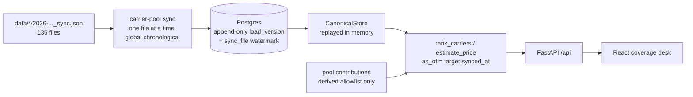

# Carrier Pool: Platform and Frontend

The engine is done and correct (29 tests green, point-in-time as-of ranking, explainable components). Everything below is the layer that makes it a product a reviewer can run and a broker could use.

## Architecture



Nothing is ever patched. A correction arrives as a new `load_version` row; the as-of projection is recomputed. That is the direct answer to the README's "patch or rebuild" question, and it is what we write up in `DECISIONS.md`.

## Phase 1: Persistence and ingestion

Refactor [backend/src/carrier_pool/ingest.py](backend/src/carrier_pool/ingest.py) so each TMS parser is a pure per-file function returning a `ParsedSync(carriers, customers, versions, rate_rows)`. `ingest_data(Path)` keeps working unchanged for the existing tests; the new DB writer consumes the same parsers.

The one subtlety is HaulDesk: `_ingest_hauldesk` currently accumulates `rates_by_load[...] += amount` across files in a local dict. Persist the raw rate rows instead, keyed by `rate_id`, and compute each version's totals as the sum of rows with `synced_at <= version.synced_at`. Same numbers, and it makes as-of pricing exact rather than incidental.

New files:

- `backend/src/carrier_pool/db.py` — psycopg3 connection plus `schema.sql` (`broker`, `sync_file`, `carrier`, `customer`, `load_version`, `hauldesk_rate`). `load_version` is append-only with `unique (broker_id, raw_load_id, source_file)`.
- `backend/src/carrier_pool/sync.py` — CLI that merges all three broker directories into one global chronological stream by `synced_at`, then processes **one file at a time**, skipping any `(broker_id, filename)` already in `sync_file`. Resumable and idempotent, so container restarts are free.
- `backend/src/carrier_pool/repository.py` — `store_from_db()` replays versions into a `CanonicalStore`.

Acceptance test: a store built from Postgres and a store built from files produce identical rankings and price estimates for all 8 active loads.

## Phase 2: Shared carrier pool

Eligibility requires an authority number, so the pool runs between FreightFlow and HaulDesk only; BrokerOS carriers have no MC/DOT and cannot be proven distinct from a carrier you already know. The UI states this rather than hiding it.

`backend/src/carrier_pool/pool.py` defines a frozen allowlist — the entire set of fields that may cross a broker boundary:

```python
POOL_FIELDS = frozenset({
    "carrier_name", "mc_number", "dot_number", "home_city", "home_state",
    "equipment_types", "lane_cells", "on_time_band", "recency_band",
})
```

`lane_cells` are ZIP3-to-ZIP3 pairs with a bucketed activity band, never ZIP5, never exact counts. No dollar amount, customer, load id, or source file ever crosses. Pool carriers score on lane coverage, equipment, and the on-time band only; their price falls back to the requesting broker's own market estimate and the UI says so.

Pool carriers render in a separate tier below the broker's own carriers and are never interleaved. That gives four testable invariants: enabling the pool leaves every own-carrier score and the price estimate bit-identical; the serialized crossing payload's recursive key set equals `POOL_FIELDS`; Delta Prime never appears in the pool tier for either broker and keeps its own-history score; an opted-out broker neither contributes nor receives.

`GET /api/pool/policy` returns the allowlist and eligibility rules so the UI disclosure renders from the same constant the tests assert against.

## Phase 3: API

`backend/src/carrier_pool/api/` (FastAPI, already in the venv):

- `GET /api/brokers` — name, load counts, pool opt-in
- `GET /api/brokers/{id}/loads` — queue, active first
- `GET /api/brokers/{id}/loads/{load_id}` — detail plus full version history (the corrections trail)
- `GET /api/brokers/{id}/loads/{load_id}/recommendation?as_of=&pool=` — price estimate plus ranked carriers with components, reasons, limitations, comparables
- `GET /api/brokers/{id}/syncs` — ingestion log, powers the as-of control
- `PUT /api/brokers/{id}/pool-opt-in`
- `GET /api/pool/policy`, `GET /health`

A `serializers.py` enriches each ranking with geometry from `GeoIndex` (target lane, weighted historical lane traces, last delivery point) so the map is server-computed and `ranking.py` stays untouched. A small store cache invalidates when the sync watermark advances.

## Phase 4: Frontend

Vite + React + TS, plain CSS with custom properties, hand-rolled SVG. No component or chart library.

**Direction.** The interface is a coverage desk, and its organizing idea is that *statistical confidence is rendered as visual weight* — thin evidence is literally lighter and less saturated, everywhere, so the honesty of the shrinkage model is visible rather than buried in a label.

- Color: `--paper #EFF1EE` (cool grey-green, not cream), `--ink #17211F` (petrol black), `--haul #0E4F52` (teal, structure), `--signal #C2660B` (burnt amber, reserved exclusively for loads needing coverage), `--trace #7B8C88` (sage, low-confidence and secondary).
- Type: **Archivo** for display and lane headings (wide industrial grotesque, signage vernacular), **IBM Plex Sans** for body, **IBM Plex Mono** tabular for every number, ZIP, MC, and load id. Self-hosted via fontsource so the container needs no network.
- Layout: two panes, not a three-column dashboard. Left is the load queue; right is the selected load. Carrier reasoning expands inline directly beneath the carrier it explains.
- Signature: a **lane trace map** inside the expanded carrier row — a compact SVG of the Texas Triangle plotted from real ZCTA centroids, drawing the target lane solid, the carrier's historical lanes at opacity equal to their lane weight, and a dashed deadhead vector from their last known delivery to this pickup. Every visual property maps to a number the ranker actually used.
- Restraint: the only motion is a FLIP reorder of the rank list when the as-of control moves or the pool toggles, which is exactly the moment worth animating. `prefers-reduced-motion` respected.
- Copy: "Call first", "Expect to pay", "Why", "What we don't know". Plain and active.

The as-of control is a thin tick strip of that broker's 45 sync files, marked where this load changed — it makes the correction scenario draggable instead of theoretical.

## Phase 5: Run path

`docker-compose.yaml` with `db` (postgres:16-alpine, healthcheck), `backend` (schema init, then `carrier-pool sync`, then uvicorn; `data/` mounted read-only), and `frontend` (nginx serving the build and proxying `/api`, so no CORS). `scripts/verify.sh` brings the stack up, waits on `/health`, and asserts the known day-11 answers end to end — Ibrahim first with high confidence on the sanity load, own-carrier scores unchanged when the pool toggles. README gets a run section; `DECISIONS.md` entry 7 ("backend-only and has no API or UI wiring yet") is replaced with the persistence, pool-boundary, and scaling rationale.