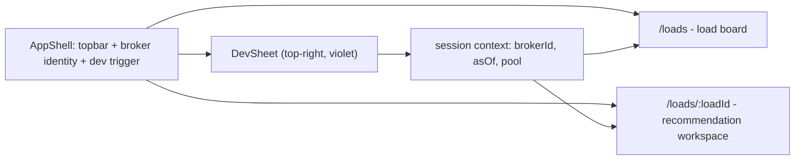

# Tabular dashboard redesign

## What's wrong today

[frontend/src/App.tsx](frontend/src/App.tsx) is a single 479-line component and [frontend/src/styles.css](frontend/src/styles.css) is a poster aesthetic: a `clamp(3rem, 9vw, 7.5rem)` Archivo headline, 24px rounded cards with 70px shadows, warm paper canvas, and — most importantly — the three brokers rendered as first-class top-level tabs, which makes the app read as a multi-tenant demo rather than one broker's desk. Carriers are stacked cards, not rows, so nothing is comparable at a glance.

## Direction

Light enterprise, dense, tabular. Two routes. **All UI comes from shadcn/ui, sourced through the shadcn MCP — no hand-written CSS files.**

- Palette: canvas `#F6F7F9`, surface `#FFFFFF`, ink `#0F1418`, muted `#626C7A`, hairline rule `#E2E6EC`, accent cobalt `#1B4DE4`. Semantic: `#0E7C5A` positive, `#B45309` caution, `#B3261E` negative. Dev tooling gets its own violet `#7C3AED` so anything non-production is visually quarantined. These land as values in the shadcn theme variables (`--background`, `--foreground`, `--primary`, `--border`, `--muted-foreground`) plus a few extra custom properties in the same `@theme` block, so they are reachable as Tailwind utilities like `bg-background` and `text-dev`.
- Type: keep IBM Plex Sans for UI and IBM Plex Mono for every numeral (`tabular-nums` utility, right-aligned money and rates), wired through `--font-sans` / `--font-mono` in the theme block. Drop Archivo entirely — that was the poster face. Column headers are `text-[10.5px] uppercase tracking-[0.08em] font-mono`.
- Density: `h-8` table rows, 12/13px body, 4px radii, hairline `border` instead of shadows. Sticky headers, sortable columns, no zebra striping. Density is achieved by overriding the stock shadcn padding with utility classes on the components, not by editing the generated component files.
- Signature element: a **weighted-contribution bar** in each ranked-carrier row — one segmented bar where each segment's width is `weight x score` for the seven scoring components, drawn in a single-hue cobalt ramp so it reads as one instrument rather than a rainbow chart. It answers the brief's "why" question inline and expands into a full component waterfall on row expand. Paired with a **price band ruler** on the detail page plotting low/point/high with tick marks for `observed_ppm` vs `prior_ppm`.

## Component sourcing rule

Every visual element is a shadcn registry component or a composition of Tailwind utility classes over one. Before building any piece of UI, query the registry rather than guessing at the API:

- `search_items_in_registries` / `view_items_in_registries` to find and read the component.
- `get_item_examples_from_registries` for the real usage pattern (notably `data-table-demo`, which is the TanStack-backed sortable table this whole design rests on).
- `get_add_command_for_items` to get the exact `npx shadcn@latest add ...` command, then run it.
- `get_audit_checklist` at the end.

The only stylesheet in the repo is the single `src/index.css` that `shadcn init` generates — `@import "tailwindcss"` plus the theme variable block where the palette above is defined. No component-scoped CSS, no `styles.css`, no CSS modules. The two places without a registry equivalent (the contribution bar and the lane-trace SVG) are built from Tailwind utilities and inline SVG with `style={{ width: ... }}` for the data-driven dimensions only.

Planned registry components: `table`, `badge`, `card`, `button`, `sheet`, `select`, `slider`, `switch`, `input`, `separator`, `tooltip`, `collapsible`, `skeleton`, `breadcrumb`, `toggle-group`, `scroll-area`, `dropdown-menu`, `alert`, `sonner`. Final list gets confirmed against the registry during the build.

## Build setup this requires

shadcn needs Tailwind and a path alias, which this Vite app does not have yet:

- Add `tailwindcss` v4 + `@tailwindcss/vite`, register the plugin in [frontend/vite.config.ts](frontend/vite.config.ts), and add the `@/*` -> `./src/*` alias in both the Vite config (`resolve.alias`) and [frontend/tsconfig.json](frontend/tsconfig.json) (`baseUrl` + `paths`).
- Change `moduleResolution` from `"Node"` to `"Bundler"` in `tsconfig.json`; Tailwind v4 and the shadcn dependencies use `exports` maps that `"Node"` resolution will not resolve.
- Run `npx shadcn@latest init` to produce `components.json` and `src/index.css`, then delete [frontend/src/styles.css](frontend/src/styles.css).
- [frontend/Dockerfile](frontend/Dockerfile) copies an explicit file list (`index.html tsconfig.json vite.config.ts`). Any new root-level config file that init creates — `components.json`, or split `tsconfig.app.json` / `tsconfig.node.json` — has to be added to that `COPY` line or the container build breaks while local dev keeps working. Prefer keeping a single flat `tsconfig.json`.

## Structure



Broker lives in a session context persisted to `localStorage`, never in the URL — in a real tenant app the broker comes from auth, and dev mode is impersonation. Switching broker while on a detail page redirects to `/loads`.

## Dev tools drawer

A `Sheet` opening from the right, triggered by a small outline `Button` in the topbar's right corner labeled `Dev tools`. Violet dashed border so it is never mistakable for product chrome. Always available — reviewers run the Docker production build, so gating on `import.meta.env.DEV` would hide it from them. Contents:

- **View as broker** — `Select` over `/api/brokers`. When not the default broker, a persistent violet `Badge` sits in the topbar: `Viewing as HaulDesk Logistics`.
- **As-of replay** — a `Slider` over `/api/brokers/{id}/syncs`, with the syncs that actually changed the current load called out beneath it (`detail.versions` source files). Drives the existing `as_of` query param. Active state shows a topbar `Badge`.
- **Shared carrier pool** — `Switch` bound to `PUT /pool-opt-in`, plus the `/api/pool/policy` boundary fields.
- **Request log** — the exact API URLs backing the current view in a `ScrollArea`, so the reasoning is traceable.

## Load board — `/loads`

- Stat strip of compact `Card`s: needs coverage, booked, completed, average margin on completed, last sync time. No gradients.
- Filter row: `Input` search, `ToggleGroup` status filter, `Select` for equipment.
- Sortable `Table` driven by the registry's TanStack `data-table` pattern: Load ID, status `Badge`, Lane (`Arlington, TX 76010 -> Sugar Land, TX 77478`), Equipment, Miles, Weight, Pickup window, Customer rate, Carrier rate, Margin, **Est. carrier cost + confidence**, **Top carrier**. Row click navigates to the detail route.
- The last two columns need `/recommendation`, so fetch it only for `active` rows with a concurrency cap of 4, rendering `Skeleton` cells until each resolves. Everything else comes from the single `/loads` call.

## Load detail — `/loads/:loadId`

- `Breadcrumb`, load ID, status `Badge`, and customer/equipment/miles/weight/windows as a compact definition grid.
- **Price estimate** `Card`: point value with the band ruler, `basis` and `effective_loads` as `Badge`s, confidence `Badge`, reasons and limitations as lists.
- **Ranked carriers** `Table`: rank, carrier, score, contribution bar, expected cost, confidence, lead reason. Each row is a `Collapsible` that opens the evidence panel — component table (name, weight, score, contribution, evidence key/values), the restyled lane-trace SVG (hairline, precise, ~180px), reasons, limitations. `Tooltip` on each contribution segment.
- **Comparables** `Table` for the price basis: load, lane, equipment, ppm, carrier rate, source file (8 rows in the sample payload).
- **Pool tier**: separate `Table` with a dashed left border and contributor-broker column; boundary payload rendered as a key/value table beside the policy note. Only when pool is on.
- **Version history**: `detail.versions` as a `Table`, one row per sync, with changed cells highlighted against the prior version. This directly demonstrates the corrections behavior the brief asks about and is currently unused beyond a set of filenames.

## Files

Generated by the CLI: `frontend/components.json`, `frontend/src/index.css`, `frontend/src/components/ui/*` (registry components — left as generated, not hand-edited), `frontend/src/lib/utils.ts`.

Written by hand (TSX with Tailwind classes only): `api/client.ts`, `api/types.ts`, `session.tsx`, `format.ts`, `components/{AppShell,DevSheet,ContributionBar,PriceBand,LaneMap,CarrierEvidence,VersionHistory}.tsx`, `pages/{LoadBoardPage,LoadDetailPage}.tsx`.

Deleted: `App.tsx`, `api.ts`, `types.ts`, `styles.css`. [frontend/package.json](frontend/package.json) gains `react-router-dom`, `tailwindcss`, `@tailwindcss/vite`, and the shadcn peer deps the CLI installs; `@fontsource/archivo` comes out. [frontend/nginx.conf](frontend/nginx.conf) already has `try_files $uri /index.html`, so routing works in the container as-is.

## One backend fix

`brokers()` in [backend/src/carrier_pool/repository.py](backend/src/carrier_pool/repository.py) counts `active` across every `load_version` row, so the API reports 22 active loads for FreightFlow when only 3 are currently active. A dashboard that leads with counts can't ship that. Count current versions only:

```sql
left join (
  select distinct on (broker_id, raw_load_id) broker_id, raw_load_id, status
  from load_version
  order by broker_id, raw_load_id, synced_at desc, source_file desc
) cur on cur.broker_id = b.broker_id
```

This mirrors `CanonicalStore.add_version` ordering, so DB mode and file mode agree. Covered by a case in [backend/tests/test_repository.py](backend/tests/test_repository.py).

## Verification

Run the shadcn `get_audit_checklist` tool once the components are in place, then `npm run build` for the type check, `docker compose up --build` (this is where a missed Dockerfile `COPY` for a new config file surfaces), then `./scripts/verify.sh` to confirm the API contract is unchanged, plus a manual pass over the board, detail, as-of replay, and broker impersonation.