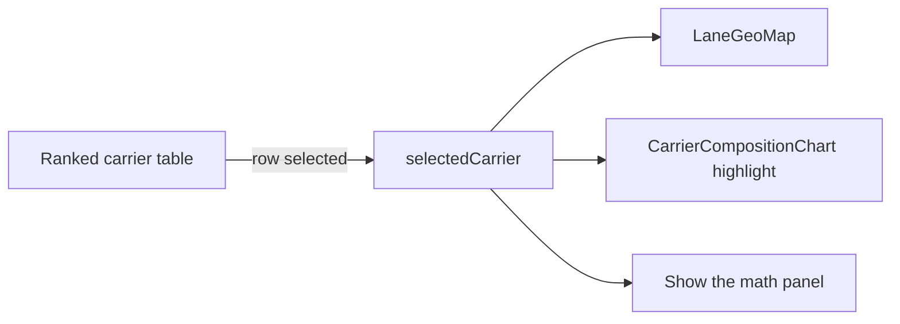

# Demo-ready UI pass

Four changes: per-view column visibility on the board, a plain-language reorganization of the detail page, Plotly for all three visuals, and a non-modal dev sheet.

## 1. Board: hide columns a view never populates

[frontend/src/pages/LoadBoardPage.tsx](frontend/src/pages/LoadBoardPage.tsx) already holds the filter in `status`. Derive a `columnVisibility` object from it and pass it into `useReactTable` state:

- Needs coverage: hide `carrier_rate_usd` and `margin` (no carrier booked yet, both always dashes).
- Booked and Delivered: hide `estimate` and `topCarrier` (a carrier is already on it).
- All: everything visible.

Also rename the `synced` column header from "Last sync" to "Updated" - a broker does not think in syncs.

## 2. Detail page: same data, broker language, one screen

The rule for every element: if a broker would act on it, it is visible; if it exists to prove the algorithm is right, it goes behind one labelled click. Nothing is deleted.

Visible on load:

- Lane, status, and six facts: customer, equipment, weight, miles, pickup window, customer rate. The other six (delivery window, carrier rate, distance detail, last sync, source file, appointment actuals) move into a "Load details" disclosure.
- Expected cost with the confidence badge and the price chart.
- One sentence of plain English instead of the current shrinkage line. Today it reads "Observed $4.83/mi shrunk toward the $5.13/mi broker prior on 7.2 effective loads." It becomes: "Similar lanes in your history ran $1,318. Your average across all lanes is $1,401. We suggest $1,349."
- The ranked carrier table, a single lane map, and the carrier comparison chart.

Behind a click:

- "Show the math" on the price panel: `basis`, effective loads, the per-mile figures, the verbatim `reasons` and `limitations`, and the 8-row comparables table.
- "Show the math" on a carrier: the component table with weights, contributions, and raw evidence keys such as `shrunk_ppm` and `price_effective_loads`.
- "What was shared" on each pool carrier: the boundary payload including `lane_cells`, `on_time_band`, `mc_number`.
- "Change history" disclosure wrapping the sync table, with a summary in the trigger: "11 updates, carrier rate corrected once".

New [frontend/src/labels.ts](frontend/src/labels.ts) holds the translations so no raw enum reaches the screen:

- `lane_familiarity` to "Knows this lane", `positioning` to "Truck nearby", `price` to "Price history", `reliability` to "On-time record", `relationship` to "Works with you", `customer_affinity` to "Knows this customer", `stability` to "No surprises".
- `basis` values: `similar_lane` to "similar lanes", `carrier_similar_lane` to "this carrier on similar lanes".
- The score becomes a "Match" out of 100 (`0.743` renders as `74`); the raw value stays in the math panel.

## 3. Plotly for all three visuals

Add `plotly.js`, `react-plotly.js`, `@types/plotly.js`, `@types/react-plotly.js`. Build a custom bundle in a new [frontend/src/charts/plotly.ts](frontend/src/charts/plotly.ts) rather than `plotly.js-dist-min`, so only what is used ships:

```ts
import Plotly from "plotly.js/lib/core";
import bar from "plotly.js/lib/bar";
import scattergeo from "plotly.js/lib/scattergeo";
import "plotly.js/dist/plotly-geo-assets.js"; // registers topojson on window.PlotlyGeoAssets
Plotly.register([bar, scattergeo]);
```

The geo-assets side-effect import is what makes the map work offline; without it `scattergeo` fetches topojson from the Plotly CDN and renders blank in Docker. The same module reads the palette off the theme with `getComputedStyle(document.documentElement).getPropertyValue("--comp-1")` so chart colors stay defined only in [frontend/src/index.css](frontend/src/index.css), and exports a shared layout (transparent paper, no modebar, IBM Plex Mono ticks).

Three chart components replace the three custom ones:

- `CarrierCompositionChart` - one horizontal stacked bar, carriers on the y axis, the seven components stacked with human labels. This replaces the five per-row `ContributionBar`s, so the comparison gets stronger while the table gets lighter. This is the chart to talk over for most of the demo.
- `PriceRangeChart` - the low-to-high band as a bar with markers for "similar lanes", "your average", and "we suggest". Everything is converted to dollars (`ppm * distance_miles`) so one axis carries one unit, unlike today's split dollar and per-mile rulers.
- `LaneGeoMap` - `scattergeo` with `scope: "usa"`, `resolution: 50`, and lat/lon ranges pinned to the Texas Triangle. Carrier history lanes, the dashed deadhead, and the target lane draw as real geography instead of the hand-drawn triangle.

Crucially there is **one** map, not one per carrier. It sits beside the carrier table and redraws for whichever row is selected, which is both far lighter than five maps and a better demo beat: click down the ranking and watch the history light up.

Delete [frontend/src/components/ContributionBar.tsx](frontend/src/components/ContributionBar.tsx), [frontend/src/components/PriceBand.tsx](frontend/src/components/PriceBand.tsx), and [frontend/src/components/LaneMap.tsx](frontend/src/components/LaneMap.tsx).



## 4. Dev sheet: non-modal, no overlay, no request log

In [frontend/src/components/DevSheet.tsx](frontend/src/components/DevSheet.tsx): drop the request log section, and set `<Sheet modal={false}>` so the board stays live and interactive while the sheet is open.

`SheetContent` in [frontend/src/components/ui/sheet.tsx](frontend/src/components/ui/sheet.tsx) hardcodes `<SheetOverlay />`, which carries the `backdrop-blur-xs` and dims the page. Add an `overlay = true` prop and pass `overlay={false}` from the dev sheet. That is a small edit to a generated file, which is normal for shadcn since these are checked-in source, and it is the only way to keep the page readable while switching brokers or scrubbing the timeline.

Remove the now-dead `requestLog` store and its `record()` calls from [frontend/src/api/client.ts](frontend/src/api/client.ts).

## Verification

`npm run build` while watching the bundle report - if the custom Plotly bundle lands too heavy, fall back to lazy-loading the chart module on the detail route. Then `docker compose up --build` and `./scripts/verify.sh`, plus a screenshot pass over each board filter, the detail page in both collapsed and expanded states, and the dev sheet open over a live board.